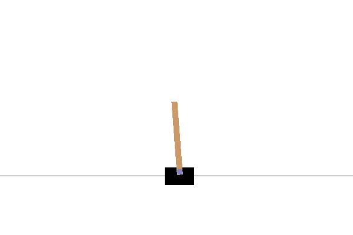
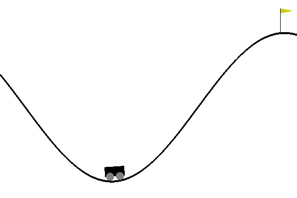

# Tutorial / Case Studies

This page describes how to run many of the examples included in the VerifAI repository, which illustrate the main use cases of VerifAI.
After cloning the repository, you can install the extra dependencies needed for the examples by running:

```
python -m pip install -e ".[examples]"
```

## Emergency Braking with a simple Newtonian simulator
**Scenic** comes with a simple built-in Newtonian physics simulator, which supports running traffic scenarios.
In this example scenario we have a car (in red) whose task is to stay within its lane using a PID controller, while maintaining a safe distance of 5 meters to objects in front.

**Task:** Falsify the PID lane keeping controller

**Sample space:** distance from ego to obstacle

**Relevant files:**
1. `examples/scenic/falsify_distance.py` : Defines type of falsifier (sampler and number of iterations)
2.  `examples/scenic/newtonian/carlaChallenge2.scenic` : Scenic program defining the ego vehicle's behavior (i.e. policy) and its environment

**Running the falsifier:** To run this example go to `examples/scenic`. Then run `python falsify_distance.py`.

The falsifier runs for 5 iterations by default; you can change this by modifying `n_iters` in `falsify_distance.py`.

**Expected Output:** 
During the running of the falsifier you should see a top-down view of the simulations taking place.
When falsification has completed, the script will print out tables listing all of the samples that were generated and the associated satisfaction value of the specification, rho.
Rho represents the quantitative satisfaction of the specification such that the sample satisfies the specification if rho is positive and violates the specification if rho is negative.
The samples are separated into two tables, the **error_table** for counterexamples to the specification and the **safe_table** for all other samples.

**Learning More:**
See the README in the `examples/scenic` folder for more options the `falsify_distance.py` script supports, including running similar experiments in the CARLA driving simulator.


## Lane keeping with inbuilt simulator
**VerifAI** comes with an inbuilt simulator developed from <a href="https://github.com/dsadigh/driving-interactions">this</a> car simulator. In this example we have a car (in red) whose task is to stay within its lane using an LQR controller. 

**Task:** Falsify the LQR lane keeping controller

**Sample space:** Initial x-position, angle of rotation, and cruising speed. 

**Relevant files:**
1. `src/verifai/simulators/car_simulator/examples/lanekeeping_LQR/lanekeeping_falsifier.py` : Defines the sample space and type of falsifier (sampler and number of iterations)
2.  `src/verifai/simulators/car_simulator/examples/lanekeeping_LQR/lanekeeping_simulation.py` : Defines the controller and the simulation environment

**Running the falsifier:** To run this example open two terminal shells and go to `src/verifai/simulators/car_simulator` in each of them. Then in first one run `python examples/lanekeeping_LQR/lanekeeping_falsifier.py` and wait till you see "Server ready" in the terminal; then run `python examples/lanekeeping_LQR/lanekeeping_simulation.py` in the other one.

The falsifier runs for 20 iterations, you can change this by modifying `MAX_ITERS` in `examples/lanekeeping_LQR/lanekeeping_falsifier.py`. At the end of the runs, you should see "End of all simulations" in the terminal where you ran `python examples/lanekeeping_LQR/lanekeeping_simulation.py`.

**Expected Output:** 
During the running of the falsifier you should the samples and the associated value of the specification satisfaction (rho). Rho represents the quantitative satisfaction of the specification such that the sample satisfies the specification if the rho is positive or falsifies the specification if the rho is negative. 

You should see two tables in the first terminal where you ran `python examples/lanekeeping_LQR/lanekeeping_falsifier.py`, labeled **Falsified Samples** a collection of all falsified samples and **Safe Samples** a collection of all the samples which were safe. 


## Data augmentation
In this example we try to falsify a Neural Network (NN) trained to detect images of cars on roads.
We re-create the data augmentation example from [this](https://arxiv.org/abs/1805.06962) paper. We implemented our own picture renderer which generates images by sampling from a low dimensional modification (sample) space.

**Task:** Falsify the NN trained on the synthetic images generated by the picture rendered

**Sample space:** Image background (37 backgrounds), number of cars- (x, y) position and type of car, overall image brightness, color, contrast, and sharpness. 

**Relevant files:**
1. `examples/data_augmentation/falsifier.py` : Defines the sample space and type of falsifier (sampler and number of iterations)
2.  `examples/data_augmentation/classifier.py` : Interface to the picture renderer and instantiate the NN

**Running the falsifier:** Open two terminal shells and go to `examples/data_augmentation` in each of them. Then in first one run `python falsifier.py` and wait till you see "Server ready" in the terminal; then run `python classifier.py` in other one.

The falsifier runs for 20 iterations, you can change this by modifying `MAX_ITERS` in `examples/data_augmenatation/falsifier.py`. At the end of the runs, you should see "End of all classifier calls" in the terminal where you ran `python classifier.py`.

The falsifying samples are stored in the data structure **error_table**. We can further analyse the error_table to generate images for retraining the NN. We have introduced three techniques to generate new images for the NN re-training:
1. Randomly sample samples from the error_table
2. Top k closest (similar) sampler from the error_table
3. Use the PCA analysis on the samples to generate new samples

**Expected Output:** 
During the running of the falsifier you should the samples and the associated value of the specification satisfaction (rho). Here rho represents the qualitative (boolean) satisfaction. Its **True** if the NN correctly classifies the image.

You should see a table labeled **Error Table** a collection of all falsified samples in the first terminal where you ran `python falsifier.py`. This follows two counterexample sets, one **randomly** generated from the error table and the other with **k closest samples**. We set k = 4 in this example.
This is followed by the PCA analysis results, we report the pivot and the 2 principle components.

The images in the two counterexample sets will pop up at the end of the run. The images are saved in the `counterexample_images` folder. The images with the prefix "random_" are from the random samples counterexample set and those with the prefix "kclosest_" are from the k closest counterexample set. 


## Webots examples
To run these examples you need to download and install <a href="https://www.cyberbotics.com">Webots</a> 2018 from <a href="https://github.com/cyberbotics/webots/releases/download/R2019a/webots-R2018b.dmg">here</a>. Webots 2018 is not free software, however you can get a 30-day free trial. While choosing license please select PRO license. When you open Webots for the first time go to `Webots->Preferences` and change `Startup Mode` to Pause.

(It should be possible to adapt these examples to work under the newer open-source versions of Webots as well; mainly, the `.wbt` files need to be regenerated using the Webots OSM Importer.)

We do not currently support using Webots 2019 (even though it is free software), since we found its performance to be very poor on machines without GPUs (e.g. personal laptops).

### Scene Generation using Scenic
In this example we use the probabilistic programming language [Scenic](https://github.com/BerkeleyLearnVerify/Scenic) to generate scenes where a road is obstructed by a broken car behind traffic cones. The scene we would like to generate is made up of an ego car (in red) and a broken car (in silver) parked behind three traffic cones.

**Task:** Generate scenes using Scenic

**Sample space:** Position of the ego car in the city, position and orientation of the cones, position and orientation of the broken car

**Relevant files:**
1. `examples/webots/controllers/scenic_cones_supervisor/lane_cones.scenic` : Scenic code to generate scenes
2. `examples/webots/controllers/scenic_cones_supervisor/scenic_cones_sampler.py` : Interface to scenic 
3.  `examples/webots/controllers/scenic_cones_supervisor/scenic_cones_supervisor.py` : Interface to webots
4.  `examples/webots/worlds/shattuck_build.wbt` : Webots world of downtown Berkeley 

**Running the sampler:** Launch Webots and load the world `examples/webots/worlds/shattuck_build.wbt` (`File->Open World`). Open a terminal and go to `examples/webots/controllers/scenic_cones_supervisor` and run `python scenic_cones_sampler.py`. Once that starts running (you will notice a message "Initialized Sampler" in the terminal), you can start the simulation.

The sampler runs for 20 iterations, you can change this by modifying `MAX_ITERS` in `examples/webots/controllers/scenic_cones_supervisor/scenic_cones_sampler.py`. At the end of the runs, you should see "End of scene generation" in the Webots console and the Webots window closes.

**Expected Output:** 
During the running of the sampler you should the samples and the associated value of the specification satisfaction (rho). Since in this application we focus only on scene generation, rho does not have any practical relevance (and has been set to infinity).

You should see the collection of all samples generated by the scenic script in the terminal where you ran `python scenic_cones_sampler.py`.

### Falsification of accident scene with cones
In this example we choose a scene generated from the above case study and run our falsifier to find small variations in the initial scene variation which lead to the ego car (in red) to crash into the traffic cones. For this purpose, we fix the location of the broken car, cones, and the ego_car but introduce variations in the color of the broken, and noise in the position and orientation of the ego car, cones and the broken car.

The ego car' controller is responsible for safely maneuvering around the cones. To achieve this, we implemented a hybrid controller. Initially, the car tries to remain in its lane. 
The controller in the ego car relies on a NN we trained to detect the cones and estimate the distance to the cones. When the distance to the cone is less than 15 meters the car starts a lane changing maneuver. This can be seen as the NN warning a human in the car to change lanes. To capture the human behavior, we introduce a reaction time (which is also a parameter) of the human. 

**Task:** Falsify the NN detecting cones and the hybrid controller

**Sample space:** Initial position and orientation noise of the ego car, cruising speed of the ego car, position and orientation noise in the broken car, position error and orientation of the cones, color of the broken car, reaction time of the human

**Relevant files:**
1. `examples/webots/controllers/cones_lanechange_supervisor/cones_lanechange_falsifier.py` : Defines the sample space and type of falsifier (sampler and number of iterations)
2. `examples/webots/controllers/cones_lanechange_supervisor/cones_lanechange_supervisor.py` : Interface to webots
4.  `examples/webots/worlds/shattuck_buildings_falsif.wbt` : Webots world of downtown Berkeley 

**Running the falsifier:** 
During the running of the falsifier you should the samples and the associated value of the specification satisfaction (rho). Rho is the quantitative satisfaction.

Launch Webots and load the world `examples/webots/worlds/shattuck_buildings_falsif.wbt` (`File->Open World`). Open a terminal and go to `examples/webots/controllers/cones_lanechange_supervisor` and run `python cones_lanechange_falsifier.py`. Once that starts running (you will notice a message "Initialized Sampler" in the terminal), you can start the simulation.

The falsifier runs for 20 iterations, you can change this by modifying `MAX_ITERS` in `examples/webots/controllers/cones_lanechange_supervisor/cones_lanechange_falsifier.py`. At the end of the runs, you should see "End of simulations" in the Webots console and the Webots window closes.

Each simulation run takes about 16 seconds in the simulation time; but may take more time in real time because of overheads like the neural networks calls and rendering.

**Expected Output:** You should see a table **Unsafe Samples** the collection of all samples generated that caused the ego car to crash into the cones in the terminal where you ran `python cones_lanechange_falsifier.py`.

### Fuzz testing using Scenic
In this example we use [Scenic](https://github.com/BerkeleyLearnVerify/Scenic) to initial conditions to recreate collision scenarios at an intersection. In this example, the ego car (in green) if going straight through an intersection. The front view of the ego car is obstructed by a set of cars (in silver) which are stopped at the intersection. A human car (in red) attempts to the take a left turn at the intersection. In this scenario, the camera of both the ego car and the human car are obstructed by the silver cars standing at the intersection. We use scenic to sample the initial positions and orientations of the ego car, human car and couple of the standing cars at the intersection. 

To reduce the chances of collision, we designed a controller for the ego car which utilizes the information coming from a "smart intersection". The smart intersection sends a warning to the ego car, when the human car approaches the intersection. Based on how early the warning comes in, we reduce the number of collision scenarios. 

**Task:** Generate accident scenarios and test controllers with "smart intersection"

**Sample space:** Position and orientation of the ego car, human car and standing cars 

**Relevant files:**
1. `examples/webots/controllers/scenic_intersection_supervisor/intersection_crash.scenic` : Scenic code to generate scenes
2. `examples/webots/controllers/scenic_intersection_supervisor/scenic_intersection_sampler.py` : Interface to scenic 
3.  `examples/webots/controllers/scenic_intersection_supervisor/scenic_intersection_supervisor.py` : Interface to webots
4.  `examples/webots/worlds/scenic_intersection.wbt` : Webots world of the intersection 

To run this example, you need to install pyproject, `$pip install pyproj`

**Running the sampler:** Launch Webots and load the world `examples/webots/worlds/scenic_intersection.wbt` (`File->Open World`) . Open a terminal and go to `examples/webots/controllers/scenic_intersection_supervisor` and run `python scenic_intersection_sampler.py`. Once that starts running (you will notice a message "Initialized Sampler" in the terminal), you can start the simulation.

To test the original scenario without the smart intersection, ensure that `ignore_smart_intersection = True` on line 24 in the file `examples/webots/controllers/smart_brake/smart_brake.py`. To test with smart intersection set `ignore_smart_intersection = False`. You can update how early the warning is sent by updating the value of `intersection_buffer` in line 111 in `scenic_intersection_supervisor.py`. If set to 0, then the warning is given only when the human car enters the intersection. If > 0, the warning is sent when the car is some distance away from the intersection. If < 0, the warning is sent when the car is some distance inside the intersection.

The sampler runs for 20 iterations, you can change this by modifying `MAX_ITERS` in `examples/webots/controllers/scenic_intersection_supervisor/scenic_intersection_sampler.py`. At the end of the runs, you should see "End of accident scenario generation" in the Webots console and the Webots window closes.

Each simulation run takes about 16 seconds in the simulation time; but may take more time in real time because of overheads like rendering and communication between controllers.

**Expected Output:** 
During the running of the sampler you should the samples and the associated value of the specification satisfaction (rho). Since in this application we focus only on scenario generation, rho does not have any practical relevance (and has been set to infinity).

You should see the collection of all samples generated by the scenic script in the terminal where you ran `python scenic_intersection_sampler.py`.


## OpenAI Gym examples
The following two examples require the `baselines` package, which does not support TensorFlow 2 (needed for other examples above), so they cannot be easily run at the moment.
We leave them here since they were discussed in the VerifAI paper and provide examples of how to use VerifAI with reinforcement learning algorithms.
We would welcome a pull request updating them to use an RL library which is actively maintained!

These examples require at least version 0.1.6 of the `baselines` package.
As of May 2020, the version on PyPI is too old and will not work, so you need to install `baselines` from its [repository](https://github.com/openai/baselines").
Follow the installation instructions given there, remembering to first activate your virtual environment if necessary.

### Cartpole
In this example we want to test the robustness of a controllers to changes in model parameters and initial states of the cartpole from <a href="https://gym.openai.com">openAI gym</a>.
<figure>
  
  <figcaption>
      Cartpole Environment from OpenAI Gym: Model parameters - length and mass of pole; and mass of cart
  </figcaption>
</figure>

We use <a href="https://github.com/openai/baselines">OpenAI baselines</a> to train a NN to control the cartpole . We train a NN using Proximal Policy Optimization algorithms (<a href="https://arxiv.org/abs/1707.06347">PPO</a>) with 100000 training episodes.

We use the reward function as the specification for testing; i.e., if the reward is positive for all the environments the controller is safe. For the cartpole, the specification is: the maximum variation of the pole from the center should be less than 12 degree and maximum variation of the initial position should be less than 2.4m. To test the controller we loosen the training thresholds for angle, by 0.01 radians, and the x variation, by 0.1m, to get the testing thresholds. To capture this we define a specification using metric temporal logic <a href="https://github.com/mvcisback/py-metric-temporal-logic">python library</a> which **VerifAI** can convert into a monitor internally. 


**Task:** Test the robustness of the NN controller trained using PPO 

**Sample space:** Initial state x position and rotation of the cartpole, model parameters - mass and length of pole and mass of the cart

**Relevant files:**
1. `examples/openai_gym/cartpole/cartpole_falsifier.py` : Defines the sample space and type of falsifier (sampler and number of iterations)
2.  `examples/openai_gym/cartpole/cartpole_simulation.py` : Interface to OpenAI gym and baselines

**Running the falsifier:** 
During the running of the falsifier you should the samples and the associated value of the specification satisfaction (rho). Rho is the quantitative satisfaction.

Open two terminal shells and go to `cd examples/openai_gym/cartpole` in each of them. Then in first one run `python cartpole_falsifier.py` and wait till you see "Initialized sampler" in the terminal; then run `python cartpole_simulation.py` in other one.

The falsifier runs for 20 iterations, you can change this by modifying `MAX_ITERS` in `examples/openai_gym/cartpole/cartpole_falsifier.py`. At the end of the runs, you should see "End of all cartpole simulations" in the terminal where you ran `python cartpole_simulation.py`.

**Expected Output:** 
During the running of the falsifier you should the samples and the associated value of the specification satisfaction (rho). Rho is the quantitative satisfaction.

You should see the error table **Counter-example samples** containing all falsified samples in the terminal where you ran `python cartpole_falsifier.py`

### Mountaincar
In this example we show the effect of hyper-parameters to train NN to control the mountaincar environment from <a href="https://gym.openai.com">openAI gym</a>. 
<figure>
  
  <figcaption>
      MountainCar Environment from OpenAI Gym: Goal - reach the flag
  </figcaption>
</figure>

Specifically, we see the effects of different training algorithms and size of the training set on synthesizing a NN controller. 

We treat the reward function provided by the environment as our specification. For the mountaincar, this is characterized by the distance to the flag. Here, unlike the previous examples, we would like to find the set of parameters which which ensures the NN is able to correctly control the mountaincar. To do this, we negate the specification so that falsifying the specification implies finding a safe controller. 

**Task:** Study the effect of hyperparameters in training NN controllers for mountaincar 

**Sample space:** Training algorithms - Deep RL algorithms, number of training episodes

**Relevant files:**
1. `examples/openai_gym/mountaincar/mountaincar_falsifier.py` : Defines the sample space and type of falsifier (sampler and number of iterations)
2.  `examples/openai_gym/mountaincar/mountaincar_simulation.py` : Interface to OpenAI gym and baselines

**Running the falsifier:** 
During the running of the falsifier you should the samples and the associated value of the specification satisfaction (rho). Rho is the quantitative satisfaction.

Open two terminal shells and go to `cd examples/openai_gym/mountaincar` in each of them. Then in the first one run `python mountaincar_falsifier.py` and wait till you see "Initialized sampler" in the terminal; then run `python mountaincar_simulation.py` in the other one.

The falsifier runs for 20 iterations, you can change this by modifying `MAX_ITERS` in `examples/openai_gym/mountaincar/mountaincar_falsifier.py`. At the end of the runs, you should see "End of all mountaincar simulations" in the terminal where you ran `python mountaincar_simulation.py`.

**Expected Output:** You should see a table **Hyper-parameters leading to good controllers** containing all sampled hyperparamaters which build NN which can safely control the mountaincar in the terminal where you ran `python mountaincar_falsifier.py`.