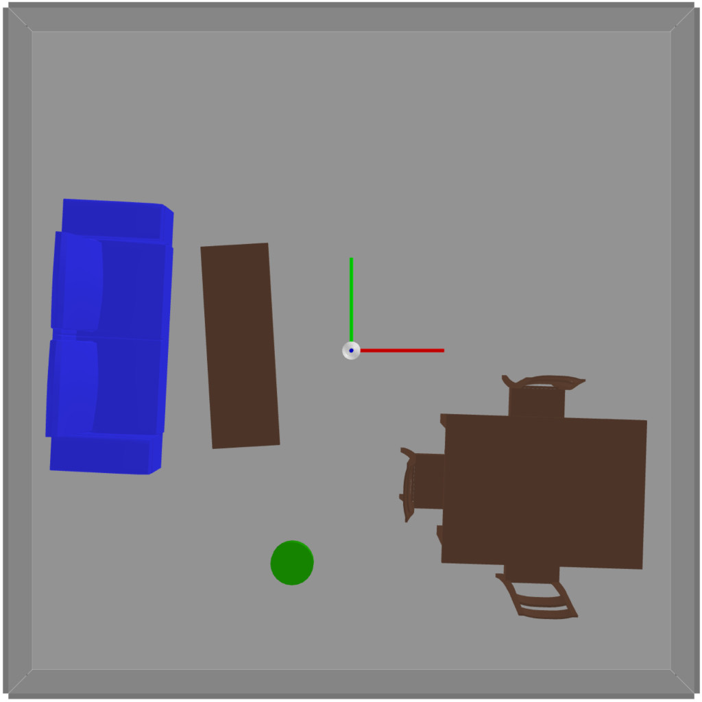
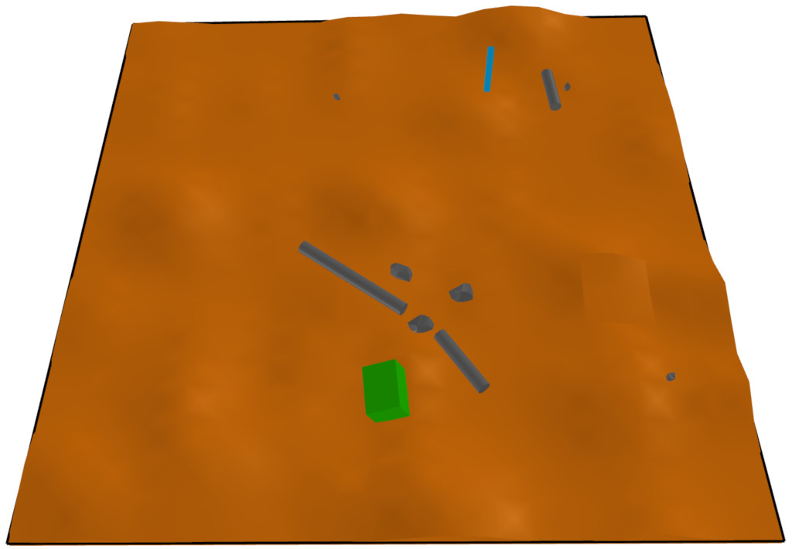

..  _quickstart:

Getting Started with Scenic
===========================

Installation
------------

Scenic requires **Python 3.8** or newer.
Run :command:`python --version` to make sure you have a new enough version; if not, you can install one from the `Python website <https://www.python.org/downloads/>`_ or using `pyenv <https://github.com/pyenv/pyenv>`_ (e.g. running :command:`pyenv install 3.11`).
If the version of Python you want to use is called something different than just ``python`` on your system, e.g. ``python3.11``, use that name in place of ``python`` when creating a virtual environment below.

There are two ways to install Scenic:

* from our repository, which has the very latest features but may not be stable. The repository also contains example scenarios such as those used in the instructions below and our tutorials.

* from the Python Package Index (PyPI), which will get you the latest official release of Scenic but will not include example scenarios, etc.

If this is your first time using Scenic, we suggest installing from the repository so that you can try out the example scenarios.

Once you've decided which method you want to use, follow the instructions below for your operating system.
If you encounter any errors, please see our :doc:`install_notes` for suggestions.

.. tabs::

	.. tab:: macOS

		Start by downloading `Blender <https://www.blender.org/download/>`__ and `OpenSCAD <https://openscad.org/downloads.html>`__ and installing them into your :file:`Applications` directory.

		.. include:: _templates/installation.rst

	.. tab:: Linux

		Start by installing the Python-Tk interface, Blender, and OpenSCAD.
		You can likely use your system's package manager; e.g. on Debian/Ubuntu run:

		.. code-block:: text

			sudo apt-get install python3-tk blender openscad

		For other Linux distributions or if you need to install from source, see the download pages for `Blender <https://www.blender.org/download/>`__ and `OpenSCAD <https://openscad.org/downloads.html>`__.

		.. include:: _templates/installation.rst

	.. tab:: Windows

		These instructions cover installing Scenic natively on Windows; if you are using the `Windows Subsystem for Linux <https://docs.microsoft.com/en-us/windows/wsl/install-win10>`_ (on Windows 10 and newer), see the WSL tab instead.

		Start by downloading and running the installers for `Blender <https://www.blender.org/download/>`__ and `OpenSCAD <https://openscad.org/downloads.html>`__.

		.. include:: _templates/installation.rst
			:end-before: .. venv-setup-start

		.. code-block:: text

			python -m venv venv
			venv\Scripts\activate.bat

		.. include:: _templates/installation.rst
			:start-after: .. venv-setup-end

	.. tab:: WSL

		These instructions cover installing Scenic on the Windows Subsystem for Linux (WSL).

		If you haven't already installed WSL, you can do that by running :command:`wsl --install` (in either Command Prompt or PowerShell) and restarting your computer.
		Then open a WSL terminal and run the following commands to install Python, the Python-Tk interface, Blender, and OpenSCAD:

		.. code-block:: text

			sudo apt-get update
			sudo apt-get install python3 python3-tk blender openscad

		.. include:: _templates/installation.rst
			:end-before: .. venv-setup-start

		.. code-block:: text

			python3 -m venv venv
			source venv/bin/activate

		If you get an error about needing a package like ``python3.10-venv``, run

		.. code-block:: text

			sudo apt-get install python3.10-venv

		(putting in the appropriate Python version) and try the commands above again.

		.. include:: _templates/installation.rst
			:start-after: .. venv-setup-end

You can now verify that Scenic is properly installed by running the command:

.. code-block:: text

	scenic --version

This should print out a message like ``Scenic 3.0.0`` showing which version of Scenic is installed.
If you get an error (or got one earlier when following the instructions above), please see our :doc:`install_notes` for suggestions.

.. note::

	If a feature described in this documentation seems to be missing, your version of Scenic may be too old: take a look at :doc:`new` to see when the feature was added.

To help read Scenic code, we suggest you install a syntax highlighter plugin for your text editor.
Plugins for Sublime Text and Visual Studio Code can be installed from within those tools; for other editors supporting the TextMate grammar format, the grammar is available `here <https://github.com/UCSCFormalMethods/Scenic-tmLanguage>`__.

Trying Some Examples
--------------------

The Scenic repository contains many example scenarios, found in the :file:`examples` directory.
They are organized in various directories with the name of the simulator, abstract application domain, or visualizer they are written for. For example, :file:`gta` and :file:`webots` for the :abbr:`GTA (Grand Theft Auto V)` and Webots simulators; the :file:`driving` directory for the abstract :ref:`driving domain <driving_domain>`; and the :file:`visualizer` directory for the built in Scenic visualizer.

Each simulator has a specialized Scenic interface which requires additional setup (see :ref:`simulators`); however, for convenience Scenic provides an easy way to visualize scenarios without running a simulator.
Simply run :command:`scenic`, giving a path to a Scenic file:

.. code-block:: text

	scenic examples/webots/vacuum/vacuum_simple.scenic

This will compile the Scenic program and sample from it (which may take several seconds), displaying a schematic of the resulting scene. Since this is a simple scenario designed to evaluate the performance of a robot vacuum, you should get something like this:

The green cylinder is the vacuum, surrounded by various pieces of furniture in a room.
You can adjust the camera angle by clicking and dragging, and zoom in and out using the mouse wheel.
If you close the window or press :kbd:`q`, Scenic will sample another scene from the same scenario and display it.
This will repeat until you kill the generator (:kbd:`Control-c` in the terminal on Linux; :kbd:`Command-q` in the viewer window on MacOS).

Some scenarios were written for older versions of Scenic, which were entirely 2D. Those scenarios should be run using the ``--2d`` command-line option, which will enable 2D backwards-compatibility mode. Information about whether or not the ``--2d`` flag should be used can be found in the :file:`README` of each example directory.

One such scenario is the badly-parked car example from our GTA case study, which can be run with the following command:

.. code-block:: text

	scenic --2d examples/gta/badlyParkedCar2.scenic

This will open Scenic's 2D viewer, and should look something like this:

.. image:: images/badlyParkedCar2.png

Here the circled rectangle is the ego car; its view cone extends to the right, where we see another car parked rather poorly at the side of the road (the white lines are curbs).
(Note that on MacOS, scene generation with the 2D viewer is stopped differently than with the 3D viewer: right-click on its icon in the Dock and select Quit.)

Scenarios for the other simulators can be viewed in the same way.
Here are a few for different simulators:

.. code-block:: text

	scenic --2d examples/driving/pedestrian.scenic
	scenic examples/webots/mars/narrowGoal.scenic
	scenic --2d examples/webots/road/crossing.scenic

.. image:: images/pedestrian.png
   :width: 29%

.. image:: images/crossing.png
   :width: 29%

The :command:`scenic` command has options for setting the random seed, running dynamic
simulations, printing debugging information, etc.: see :ref:`options`.

Learning More
-------------

Depending on what you'd like to do with Scenic, different parts of the documentation may be helpful:

	* If you want to start learning how to write Scenic programs, see :ref:`tutorial`.

	* If you want to learn how to write dynamic scenarios in Scenic, see :ref:`dynamics`.

	* If you want to use Scenic with a simulator, see :ref:`simulators` (which also describes how to interface Scenic to a new simulator, if the one you want isn't listed).

	* If you want to control Scenic from Python rather than using the command-line tool (for example if you want to collect data from the generated scenarios), see :doc:`api`.

	* If you want to add a feature to the language or otherwise need to understand Scenic's inner workings, see our pages on :doc:`developing` and :ref:`internals`.
