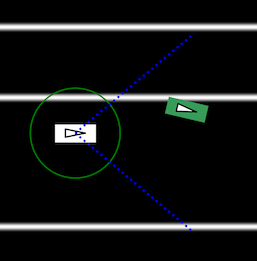
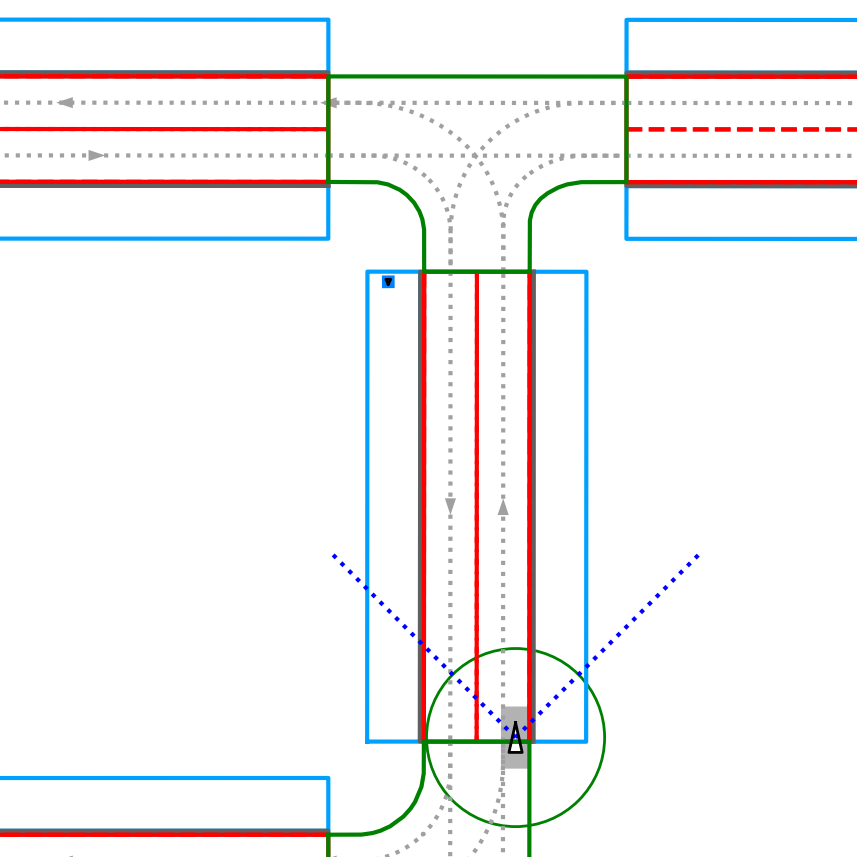
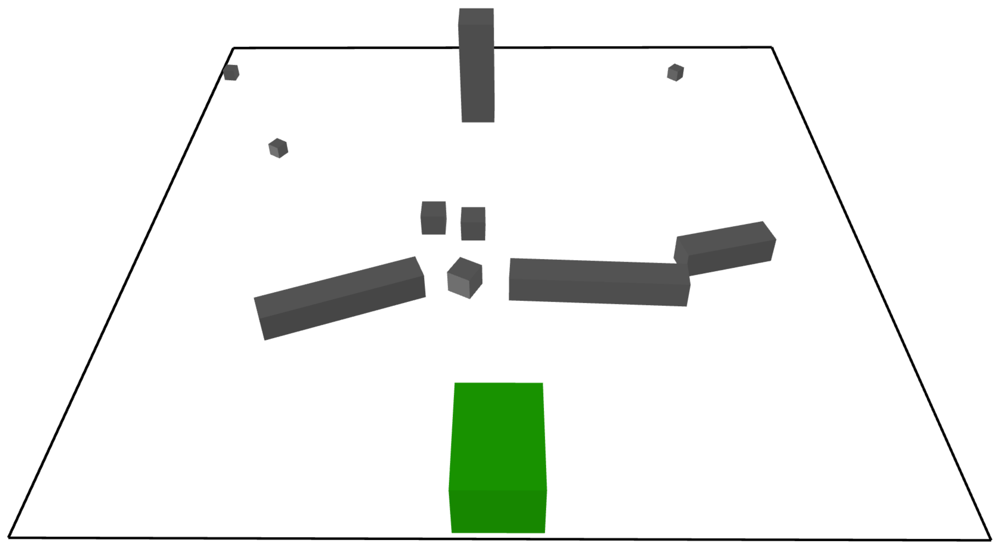
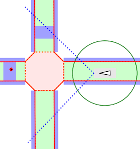

..  _quickstart:

Getting Started with Scenic
===========================

Installation
------------

Scenic requires **Python 3.7** or newer.
You can install Scenic from PyPI by simply running:

.. code-block:: console

	$ pip install scenic

Alternatively, if you want to run some of our example scenarios, modify Scenic, or make use of features that have not yet been released on PyPI, you can download or clone the `Scenic repository <https://github.com/BerkeleyLearnVerify/Scenic>`_.
Install `Poetry <https://python-poetry.org/>`_, optionally activate the `virtual environment <https://docs.python.org/3/tutorial/venv.html>`_ in which you would like to run Scenic, and then run:

.. code-block:: console

	$ poetry install

If you will be developing Scenic, add the ``-E dev`` option when invoking Poetry.

.. note::

	If you are not already using a virtual environment, :command:`poetry install` will
	create one. You can then run :command:`poetry shell` to create a terminal inside the
	environment for running the commands below.

Installing via either :command:`pip` or Poetry will install all of the dependencies which are required to run Scenic.

.. note::

	If you are using Windows, or encounter any errors when following the instructions above, please see our :doc:`install_notes` for suggestions.

Trying Some Examples
--------------------

The Scenic repository contains many example scenarios, found in the :file:`examples` directory.
They are organized by the simulator they are written for, e.g. :abbr:`GTA (Grand Theft Auto V)` or Webots; there are also cross-platform scenarios written for Scenic's abstract application domains, e.g. the :ref:`driving domain <driving_domain>`.
Each simulator has a specialized Scenic interface which requires additional setup (see :ref:`simulators`); however, for convenience Scenic provides an easy way to visualize scenarios without running a simulator.
Simply run :command:`scenic`, giving a path to a Scenic file:

.. code-block:: console

	$ scenic examples/gta/badlyParkedCar2.scenic

This will compile the Scenic program and sample from it, displaying a schematic of the resulting scene.
Since this is the badly-parked car example from our GTA case study, you should get something like this:

Here the circled rectangle is the ego car; its view cone extends to the right, where we see another car parked rather poorly at the side of the road (the white lines are curbs).
If you close the window, Scenic will sample another scene from the same scenario and display it.
This will repeat until you kill the generator (:kbd:`Control-c` in Linux; right-clicking on the Dock icon and selecting Quit on OS X).

Scenarios for the other simulators can be viewed in the same way.
Here are a few for different simulators:

.. code-block:: console

	$ scenic examples/driving/pedestrian.scenic
	$ scenic examples/webots/mars/narrowGoal.scenic
	$ scenic examples/webots/road/crossing.scenic

The :command:`scenic` command has options for setting the random seed, running dynamic
simulations, printing debugging information, etc.: see :ref:`options`.

Learning More
-------------

Depending on what you'd like to do with Scenic, different parts of the documentation may be helpful:

	* If you want to start learning how to write Scenic programs, see the :ref:`tutorial`.

	* If you want to learn how to write dynamic scenarios in Scenic, see :ref:`dynamics`.

	* If you want to use Scenic with a simulator, see :ref:`simulators` (which also describes how to interface Scenic to a new simulator, if the one you want isn't listed).

	* If you want to control Scenic from Python rather than using the command-line tool (for example if you want to collect data from the generated scenarios), see :doc:`api`.

	* If you want to add a feature to the language or otherwise need to understand Scenic's inner workings, see our pages on :doc:`developing` and :ref:`internals`.
