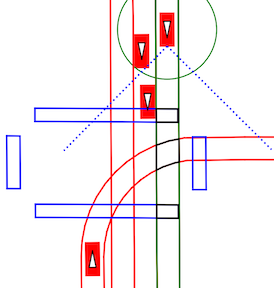

Getting Started with Scenic
===========================

Installation
------------

Scenic requires **Python 3.6** or newer.
You can install Scenic from PyPI by simply running::

	pip install scenic

Alternatively, you can download or clone the `Scenic repository <https://github.com/BerkeleyLearnVerify/Scenic>`_, which contains examples we'll use below.
Install `Poetry <https://python-poetry.org/>`_, activate the `virtual environment <https://docs.python.org/3/tutorial/venv.html>`_ in which you would like to run Scenic, and then run::

	poetry install

If you will be developing Scenic, add the ``-E dev`` option when invoking Poetry.

.. note::

	If you are not already using a virtual environment, ``poetry install`` will create one.
	In this case, you will need to prefix your commands with ``poetry run`` in order for them
	to be executed inside the environment. For instance, to run Scenic on an example you will
	need to use a command like::

		poetry run python -m scenic examples/gta/badlyParkedCar2.scenic

Either of the options above should install all of the dependencies which are required to run Scenic.
Scenarios using the `scenic.simulators.webots.guideways` model also require the ``pyproj`` package, and will prompt you if you don't have it.

.. note::
        For Windows, we recommend using `bashonwindows (the Windows subsystem for Linux) <https://docs.microsoft.com/en-us/windows/wsl/install-win10>`_ on Windows 10.  Instructions for installing poetry on bashonwindows can be found `here <https://python-poetry.org/docs/#osx-linux-bashonwindows-install-instructions>`_.
        
	In the past, the ``shapely`` package did not install properly on Windows.
	If you encounter this issue, try installing it manually following the instructions `here <https://github.com/Toblerity/Shapely#built-distributions>`_.

.. note::

	You may also want to install the ``Polygon3`` package (``pip install Polygon3``) to get
	faster and more robust polygon triangulation. However, this package is based on the
	`GPC library`_, which is only free for non-commercial use.

.. _GPC library: http://www.cs.man.ac.uk/~toby/gpc/

Trying Some Examples
--------------------

The Scenic repository contains many example scenarios, found in the :file:`examples` directory.
They are organized by the simulator they are written for, e.g. :abbr:`GTA (Grand Theft Auto V)` or Webots.
Each simulator has a specialized Scenic interface which requires additional setup (see :doc:`simulators`); however, for convenience Scenic provides an easy way to visualize scenarios without running a simulator.
Simply run the ``scenic`` module as a script, giving a path to a Scenic file::

	python -m scenic examples/gta/badlyParkedCar2.scenic

This will compile the Scenic program and sample from it, displaying a schematic of the resulting scene.
Since this is the badly-parked car example from our GTA case study, you should get something like this:

.. image:: images/badlyParkedCar2.png

Here the circled rectangle is the ego car; its view cone extends to the right, where we see another car parked rather poorly at the side of the road (the white lines are curbs).
If you close the window, Scenic will sample another scene from the same scenario and display it.
This will repeat until you kill the generator (:kbd:`Control-c` in Linux; right-clicking on the Dock icon and selecting Quit on OS X).

Scenarios for the other simulators can be viewed in the same way.
Here are a few for Webots::

	python -m scenic examples/webots/mars/narrowGoal.scenic
	python -m scenic examples/webots/road/crossing.scenic
	python -m scenic examples/webots/guideways/uberCrash.scenic

.. image:: images/narrowGoal.png
   :width: 32%
.. image:: images/crossing.png
   :width: 32%

Learning More
-------------

Depending on what you'd like to do with Scenic, different parts of the documentation may be helpful:

	* If you want to learn how to write Scenic programs, see the :doc:`tutorial <tutorial>`.

	* If you want to use Scenic with a simulator, see the :doc:`Supported Simulators page<simulators>` (which also describes how to interface Scenic to a new simulator, if the one you want isn't listed).

	* If you want to add a feature to the language or otherwise need to understand Scenic's inner workings, see our page on :doc:`internals`.
