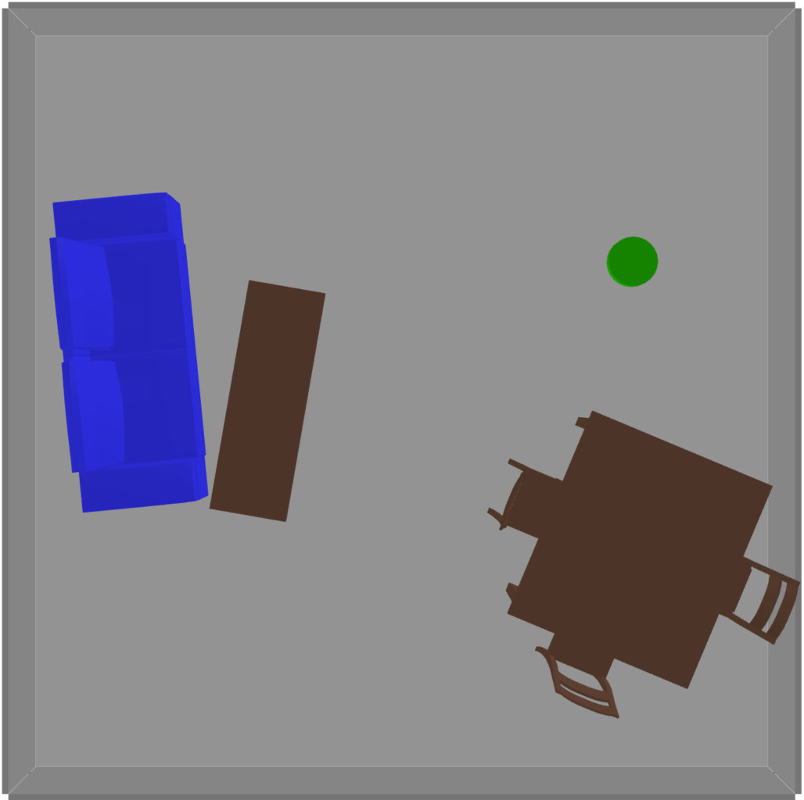

..  _quickstart:

Getting Started with Scenic
===========================

Installation
------------

Scenic requires **Python 3.8** or newer.
You can install the latest full Scenic release from PyPI by simply running:

.. code-block:: console

	$ python -m pip install scenic

Alternatively, if you want to run some of our example scenarios, modify Scenic, or make use of features that have not yet been released on PyPI, you can download or clone the `Scenic repository <https://github.com/BerkeleyLearnVerify/Scenic>`_.
Activate the `virtual environment <https://docs.python.org/3/tutorial/venv.html>`_ in which you would like to install Scenic, go into the root folder of the Scenic repository, and then run:

.. code-block:: console

	$ python -m pip install -e .

If you will be developing Scenic, you will want to use a variant of this command: see :doc:`developing`.

Either installation method will install all of the dependencies which are required to run Scenic, with the exception of `Blender <https://www.blender.org/>`_ and `OpenSCAD <https://openscad.org/>`_.
See the download pages for `Blender <https://www.blender.org/download/>`__ and `OpenSCAD <https://openscad.org/downloads.html>`__ for instructions on how to install these on your system.

.. note::

	If you are using Windows or an Apple Silicon machine, or encounter any errors during installation or when trying the examples below, please see our :doc:`install_notes` for suggestions.
	If a Scenic feature seems to be missing, your version of Scenic may be too old: take a look at :doc:`new` to see when the feature was added.

Trying Some Examples
--------------------

The Scenic repository contains many example scenarios, found in the :file:`examples` directory.
They are organized in various directories with the name of the simulator, abstract application domain, or visualizer they are written for. For example, :file:`gta` and :file:`webots` for the :abbr:`GTA (Grand Theft Auto V)` and Webots simulators; the :file:`driving` directory for the abstract :ref:`driving domain <driving_domain>`; and the :file:`visualizer` directory for the built in Scenic visualizer.

Each simulator has a specialized Scenic interface which requires additional setup (see :ref:`simulators`); however, for convenience Scenic provides an easy way to visualize scenarios without running a simulator.
Simply run :command:`scenic`, giving a path to a Scenic file:

.. code-block:: console

	$ scenic examples/webots/vacuum/vacuum_simple.scenic

This will compile the Scenic program and sample from it (which may take several seconds), displaying a schematic of the resulting scene. Since this is a simple scenario designed to evaluate the performance of a robot vacuum, you should get something like this:

The green cylinder is the vacuum, surrounded by various pieces of furniture in a room.
You can adjust the camera angle by clicking and dragging, and zoom in and out using the mouse wheel.
If you close the window or press :kbd:`q`, Scenic will sample another scene from the same scenario and display it.
This will repeat until you kill the generator (:kbd:`Control-c` in the terminal on Linux; :kbd:`Command-q` in the viewer window on MacOS).

Some scenarios were written for older versions of Scenic, which were entirely 2D. Those scenarios should be run using the ``--2d`` command-line option, which will enable 2D backwards-compatibility mode. Information about whether or not the ``--2d`` flag should be used can be found in the :file:`README` of each example directory.

One such scenario is the badly-parked car example from our GTA case study, which can be run with the following command:

.. code-block:: console

	$ scenic --2d examples/gta/badlyParkedCar2.scenic

This will open Scenic's 2D viewer, and should look something like this:

.. image:: images/badlyParkedCar2.png

Here the circled rectangle is the ego car; its view cone extends to the right, where we see another car parked rather poorly at the side of the road (the white lines are curbs).
(Note that on MacOS, scene generation with the 2D viewer is stopped differently than with the 3D viewer: right-click on its icon in the Dock and select Quit.)

Scenarios for the other simulators can be viewed in the same way.
Here are a few for different simulators:

.. code-block:: console

	$ scenic --2d examples/driving/pedestrian.scenic
	$ scenic examples/webots/mars/narrowGoal.scenic
	$ scenic --2d examples/webots/road/crossing.scenic

.. image:: images/pedestrian.png
   :width: 29%

.. image:: images/crossing.png
   :width: 29%

The :command:`scenic` command has options for setting the random seed, running dynamic
simulations, printing debugging information, etc.: see :ref:`options`.

Learning More
-------------

Depending on what you'd like to do with Scenic, different parts of the documentation may be helpful:

	* If you want to start learning how to write Scenic programs, see :ref:`tutorial`.

	* If you want to learn how to write dynamic scenarios in Scenic, see :ref:`dynamics`.

	* If you want to use Scenic with a simulator, see :ref:`simulators` (which also describes how to interface Scenic to a new simulator, if the one you want isn't listed).

	* If you want to control Scenic from Python rather than using the command-line tool (for example if you want to collect data from the generated scenarios), see :doc:`api`.

	* If you want to add a feature to the language or otherwise need to understand Scenic's inner workings, see our pages on :doc:`developing` and :ref:`internals`.
